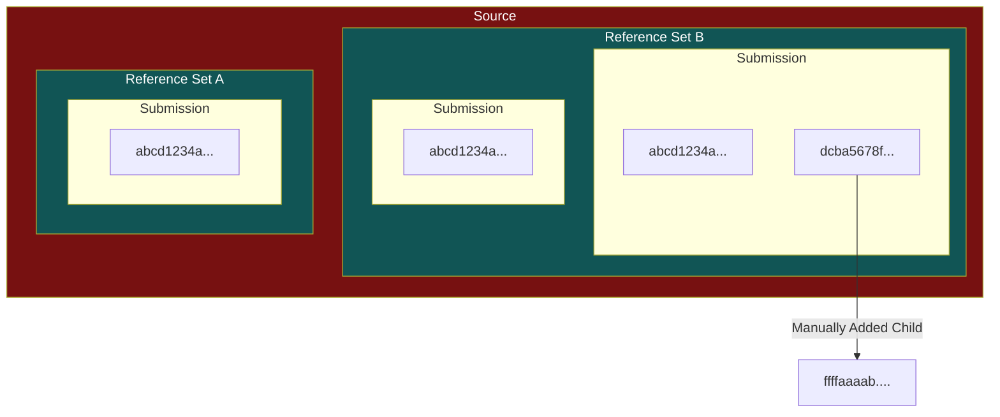

# Purging

:::note[User applicability]

This functionality is only available for admin users at this time.

:::

:::danger[Hold your horses!]

This might not work on files that have just been uploaded; wait a few minutes before purging.

:::

The Azul web UI provides several mechanisms to enable privileged users to purge files from the system.
This might be needed for a range of reasons (incorrect reference data, file inserted as TLP:CLEAR
when it is actually TLP:AMBER, etc). Carefully consider why you need this functionality before
proceeding, as purges in Azul are permanent.

Before using this functionality, it is important to understand what a purge actually does:

In the above diagram:

- A "Source" is a system-administrator defined grouping (visible in the Sources Explore page). Each source can be parameterised with a set of key:value pairs.
- A "Reference Set" is a unique set of key:value pairs submitted to a source. This can have one or more files associated to it by submissions.
- A "Submission" is an event where a user or automated process submits files to a reference set.

A source will have zero or more reference sets, a reference set will have one or more submissions
(as reference sets cease to exist without submissions), and a submission will have one or
more files (where again, this ceases to exist without files).

Files in Azul can be submitted one or more times through the submission process (achieved via
either the Upload tab in the UI or some other form of integration). These are submitted to
source(s) with reference values. For example, the 'testing' source might require an 'author'
reference value, and each reference set in this source has a different set of reference values
that differentiates it.

In the above example, there are three submissions of the file abcd1234a..., and one submission
of the file dcba5678f.... The instances of abcd1234a are all linked together in the Azul UI,
with each submission instance appearing in the "sources" tab of a binary.

With Azul 3's purging functionality, you can target some subset of this for deletion. This
functionality is surfaced through three different mechanisms:

- Purging a file via the sources tab on a binary ("Submission Purging")
- Purging a Reference Set via the sources page ("Reference Set Purging")
- Purging a link to a file via the family tab on a binary ("Link Purging")

These all have slightly different behaviour and use of one of these might better suit your
needs depending on your requirements.

## Submission Purging

Submission Purging is a mechanism where files are purged from the system where some information
about a specific binary's submission is provided.

This functionality can be accessed through the following:

- Open a file that is not desired
- Select to the "Relations" tab
- Select the "Sources" sub-tab

On this page, if Direct submissions of this file exist, a Delete button exists for each
reference set that this file is attached to (the link for which might have been established
through one or more submissions).

Note that files which purely exist through a Indirect relationship cannot be purged here;
consider deleting parent files to achieve what you want, or otherwise use the Link Purging
functionality (discussed below).

Once a submission has been identified, select the Delete button on this page.

On the following page, you can choose between a series of options to determine what can be
deleted:

| "Just the binary" | "Just this submission" | Result                                                                                                                                                                                                                                      |
| ----------------- | ---------------------- | ------------------------------------------------------------------------------------------------------------------------------------------------------------------------------------------------------------------------------------------- |
| Yes               | Yes                    | A single instance of this hash will be removed - other instances of this hash from other submissions or reference sets will remain. Any orphaned files are deleted (i.e if a file no longer has a link to a submission or a parent binary). |
| Yes               | No                     | All submissions of this hash within this reference set will be deleted. Unrelated hashes and submissions of this file in different reference sets will remain. Any orphaned files are deleted.                                              |
| No                | Yes                    | The entire submission will be deleted. Other instances of deleted hashes from other submissions or reference sets will remain. Any orphaned files are deleted.                                                                              |
| No                | No                     | The most dangerous. All submissions in this reference set will be deleted (regardless of hash). Other submissions of these files in different reference sets will remain. Any orphaned files will be deleted.                               |

A preview screen follows which simulates the deletion, and will present statistics about what
will be deleted as a result.

## Reference Set Purging

This purge type can be initiated from the Sources page. Navigate to a source and
a Delete button can be observed next to each Reference Set on this page.

This follows a similar process to Submission Purging, but unlike that there
is no option to be granular - proceeding with this option will delete all
submissions in this reference set (and will delete all orphaned files). If
possible, instead use Submission Purging if you don't need to delete everything.

## Link Purging

This is a different type of purge to enable the deletion of a derived file which
has been inserted incorrectly. For example, in the above diagram you might want
to purge the link between dcba5678f and ffffaaaab.

This can be accessed through the Family tab on a binaries page.

This just deletes this specific link (and any orphaned files), and can only
purge links one at a time.
